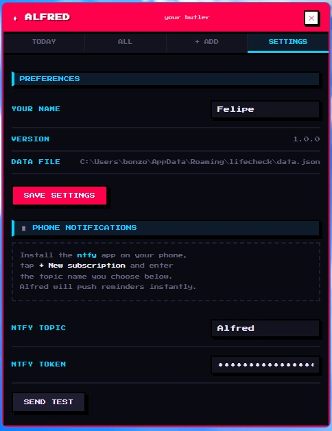

<div align="center">
  
  <h1>Alfred your Butler</h1>
  <p><strong>A pixel-art desktop companion that keeps your life organized</strong></p>
  <p>
    
    
    
    
  </p>
</div>

---

Alfred walks back and forth at the bottom of your screen. Driver's license expiring? Oil change due? Birthday coming up? He'll tell you — on your desktop and on your phone — before it's too late.

---

## Screenshots

<!-- Replace these paths with actual screenshots once the app is running -->

| Dashboard — Today | Add a reminder | Settings & phone notifications |
|:-:|:-:|:-:|
|  |  |  |

> The interface uses the **Press Start 2P** pixel-art font and a full 8-bit aesthetic — chunky borders, pixel drop-shadows, and a retro color palette on a deep navy background.

---

## What Alfred does

- Walks back and forth at the bottom of your screen — always visible, never intrusive
- Speech bubbles pop up when he has something to say
- Desktop notifications for reminders that are coming up or already overdue
- **Phone notifications** via [ntfy](https://ntfy.sh) — no account needed, completely free
- **Recurring reminders** — birthdays every year, oil changes every 2 months, etc.
- Greets you by name at startup (morning, afternoon, or evening)
- Drops butler quips every 20–45 minutes
- Rises above open windows when something urgent needs attention
- Lives in the system tray — no taskbar clutter
- All data stored in a single local JSON file — no cloud, no account, no telemetry

---

## What Alfred tracks

| | Category | Examples |
|---|---|---|
| 📄 | Document | Passport, national ID, driver's license |
| 🚗 | Vehicle | Car inspection, oil change, registration |
| 💊 | Health / Gym | Gym membership, medical appointments |
| 🎂 | Birthday | Family and friends |
| 💳 | Subscription / Bill | Netflix, Spotify, insurance |
| 📌 | Other | Anything you don't want to forget |

For each reminder you set:
- **Due date** — when the event happens
- **Alert window** — how many days in advance Alfred warns you (1 / 3 / 7 / 14 / 30 / 60 days)
- **Repeat** — how often it recurs (see below)
- **Note** — optional extra detail

---

## Recurring reminders

Alfred supports reminders that repeat automatically. When a due date passes, Alfred advances it to the next occurrence — you never have to re-create it.

| Option | Use case |
|---|---|
| Every year | Birthdays, anniversaries, annual renewals |
| Every 6 months | Semi-annual checkups, insurance reviews |
| Every 3 months | Quarterly payments, seasonal tasks |
| Every 2 months | Motorcycle oil change, bi-monthly services |
| Every month | Monthly bills, subscriptions |
| Every 2 weeks | Bi-weekly routines |
| Every week | Weekly recurring tasks |

**How it works:** The stored date is always the *next* upcoming occurrence. When Alfred's hourly check detects that a recurring reminder is past due, he advances the date and saves it — no action required from you. The dashboard also computes the next date on the fly so it's always accurate even between checks.

---

## Phone notifications via ntfy

Alfred can push reminders straight to your phone — free, with no account, no ads, and no data sold.

### What is ntfy?

[ntfy.sh](https://ntfy.sh) is a free, open-source push notification service. You pick a topic name (like a private channel), subscribe to it on your phone, and anything published to that topic arrives as a notification. The app is available on iOS and Android, and the service costs nothing.

- **Free forever** — the public server at ntfy.sh is free for personal use
- **No account required** — no sign-up, no email, no password
- **Open source** — the code is public at [github.com/binwiederhier/ntfy](https://github.com/binwiederhier/ntfy) (Apache 2.0)
- **Self-hostable** — if you want 100% private notifications, you can run your own ntfy server

> The only data sent to ntfy.sh is the reminder text (e.g. "Car inspection: due in 3 days"). No personal info, no usage tracking. Alfred never sends anything unless you configure a topic.

### Setup (2 minutes)

**1. Install the ntfy app**

| Platform | Link |
|---|---|
| Android | [Google Play](https://play.google.com/store/apps/details?id=io.heckel.ntfy) |
| iOS | [App Store](https://apps.apple.com/app/ntfy/id1625396347) |

**2. Subscribe to your topic**

Open the app → tap **+** → enter a unique topic name (e.g. `alfred-yourname`) → tap **Subscribe**.

*Choose something uncommon — the topic name is the only thing keeping notifications private on the public server.*

**3. Configure Alfred**

Open the dashboard → **Settings** tab → paste the same topic name in the **ntfy topic** field → **Save Settings** → tap **Send Test** to confirm it works.

From that point on, every time Alfred detects an upcoming or overdue reminder, you'll get a notification on your phone.

**Priority levels:**
- `high` — item is already expired or due today (shown with a warning badge on your phone)
- `default` — item is coming up within your alert window

---

## How your data is stored

Alfred stores everything in a single human-readable JSON file at:

```
Windows:  %APPDATA%\lifecheck\data.json
macOS:    ~/Library/Application Support/lifecheck/data.json
```

You can open it in any text editor, back it up, or move it between machines.

**Example `data.json`:**

```json
{
  "name": "Bruce",
  "ntfyTopic": "alfred-bruce",
  "items": [
    {
      "id": "1714000000001",
      "name": "Mom's birthday",
      "category": "birthday",
      "date": "2026-09-15",
      "alertDays": 7,
      "note": "Get cake from the usual place",
      "recur": "years",
      "recurEvery": 1
    },
    {
      "id": "1714000000002",
      "name": "Motorcycle oil change",
      "category": "vehicle",
      "date": "2026-06-01",
      "alertDays": 14,
      "note": "Use 10W-40",
      "recur": "months",
      "recurEvery": 2
    },
    {
      "id": "1714000000003",
      "name": "Renew passport",
      "category": "document",
      "date": "2027-03-20",
      "alertDays": 30,
      "note": "Book appointment at least 6 weeks before",
      "recur": "none",
      "recurEvery": 1
    }
  ]
}
```

| Field | Description |
|---|---|
| `name` | Your name, used in Alfred's greetings |
| `ntfyTopic` | Your ntfy topic — leave empty to disable phone notifications |
| `date` | Next due date (for recurring items, always the next upcoming occurrence) |
| `alertDays` | How many days before the date Alfred starts warning you |
| `recur` | `"none"` / `"days"` / `"months"` / `"years"` |
| `recurEvery` | Interval — e.g. `2` with `"months"` means every 2 months |

---

## Requirements

- **Windows 10 / 11** or **macOS 12+**
- [Node.js](https://nodejs.org) v18 or later

---

## Installation

```bash
git clone https://github.com/felipegiovanardi/LifeCheck.git
cd LifeCheck
npm install
npm link
```

Then from any terminal:

```
hi alfred
```

Alfred appears at the bottom of your screen and starts walking.

---

## Usage

| Task | How |
|---|---|
| Open dashboard | Click Alfred, or click the tray icon |
| Add a reminder | Dashboard → **+ Add** tab → fill in details → Save |
| Edit or delete | Click any card in the dashboard |
| Set up recurring | Use the **Repeat** field in the Add form |
| Configure phone notifications | Dashboard → **Settings** → ntfy topic → Save |
| Personalize | Dashboard → **Settings** → enter your name |
| Hide / show Alfred | Right-click tray icon → Show / Hide Alfred |
| Quit | Right-click tray icon → Exit |

---

## Project structure

```
LifeCheck/
├── main.js                 # Main process — walker, tray, reminders, ntfy
├── bin/hi.js               # CLI entry point for 'hi alfred'
├── renderer/
│   ├── alfred.html         # Floating Alfred window — sprites, bubble, fringe cleanup
│   └── dashboard.html      # Dashboard — Today / All / Add / Settings
├── assets/
│   ├── alfred.png          # Idle sprite (pixel art, transparent)
│   ├── alfred-walk.png     # Walk cycle sprite
│   └── tray-icon.png       # System tray icon
├── docs/                   # Screenshots for this README
└── process-sprites.js      # Dev utility: strip backgrounds from raw sprites
```

---

## Privacy

Alfred runs entirely on your machine.

- **Local data only.** Reminders live in a JSON file on your computer. Nothing is uploaded, synced, or shared.
- **No accounts.** No login, no user database, no analytics.
- **No telemetry.** The app never phones home.
- **ntfy is opt-in.** If you don't set a topic, no outbound requests are ever made. If you do, only the reminder text is sent — no device info, no identifiers.

---

## Tech stack

| Layer | Technology | Why |
|---|---|---|
| Desktop shell | [Electron](https://www.electronjs.org/) v41 | Cross-platform native window, tray, notifications |
| UI | Vanilla HTML + CSS + JS | Zero dependencies, zero build step |
| Font | [Press Start 2P](https://fonts.google.com/specimen/Press+Start+2P) | 8-bit pixel-art aesthetic |
| Animations | Pure CSS `@keyframes` | GPU compositor thread — zero JS per frame |
| Data | JSON via Node.js `fs` | Human-readable, portable, no database |
| Phone notifications | [ntfy.sh](https://ntfy.sh) via Node.js `https` | Zero extra dependencies — built-in module |
| CLI | Node.js `bin` + `npm link` | `hi alfred` from any terminal |
| Sprite processing | [Jimp](https://github.com/jimp-dev/jimp) *(dev only)* | One-time background removal; not bundled at runtime |

**Zero runtime dependencies.** Electron is the only install. ~50 MB on disk, ~80 MB RAM at idle.

---

## Inspiration

Inspired by [lil-agents](https://github.com/ryanstephen/lil-agents) — AI companions that walk across your macOS Dock. Alfred brings the same desktop-companion idea to Windows and macOS, focused on keeping your real life organized.

---

## License

Do whatever you want with it.

---

*"I have been, and always shall be, at your service."*
